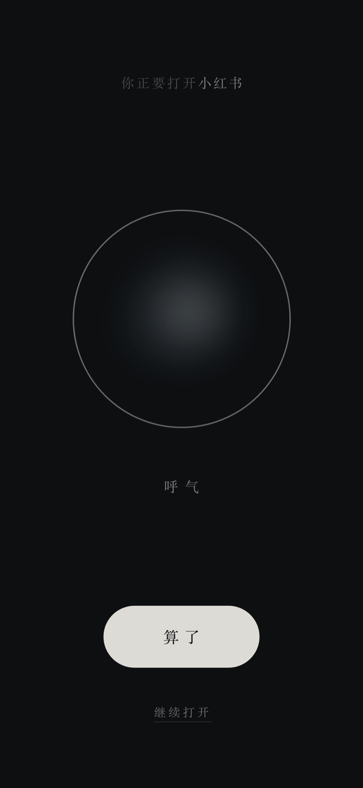
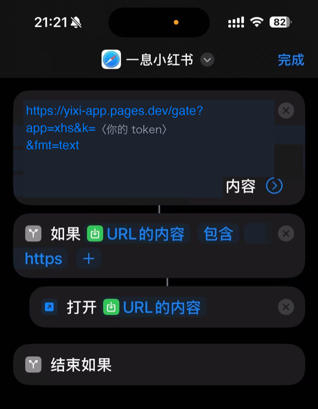

# Breathe

[← README](../README.md) · the other half of 一息 is [Today](today.md).

<p align="center">
  
  &nbsp;&nbsp;
  
</p>

<p align="center"><sub>The countdown has finished, so both choices are showing. 「算了」 (give up) is a filled pill; 「继续打开」 (open anyway) is a small underlined link. That asymmetry is deliberate — the default path should be putting the phone down. Light mode is not the dark theme brightened; it inverts into ink on paper.</sub></p>

You reach for Xiaohongshu (or Instagram, or Reddit). Before it opens, your phone jumps to a page that asks you to watch a circle and breathe. Ten seconds later you may go in, or you may put the phone down. Either way it keeps the receipt, so a week later you can see how many times you were stopped and how many of those you let go.

None of that is an app. An iOS Shortcut asks the server one question when a watched app launches, the server answers in one line of text, and Safari opens a page or nothing at all happens — which is why the whole thing fails open by construction, and why the hardest part is not the breathing but the moment control goes back to the app and the same automation fires all over again. This document covers what happens on a launch, how the Shortcut is wired, why the grace window lives on the server, and what this half cannot do.

## What happens

```
you tap 小红书
   │
   ▼
iOS "When <app> is Opened" automation fires
   │
   ▼
Shortcut: GET /gate?app=xhs&k=<token>&fmt=text
   │
   ├── body is "pass"            → Shortcut ends, the app opens normally
   │                               (not watching this app / inside a grace window
   │                                / the server is down — see "fails open" below)
   │
   └── body is "https://…/b?s=…" → Shortcut opens that URL
                                     │
                                     ▼
                         Safari: the breathing page, counting down
                            no buttons at all during the wait
                                     │
                          ┌──────────┴──────────┐
                          ▼                     ▼
                    「算了」 (drop it)      「继续」 (go in)
                    shown first, loud     shown 800ms later, quiet
                          │                     │
                    logged, you exit      logged, grace window opens,
                    the page yourself     jump back to the app
                                                │
                                                ▼
                                   the automation fires AGAIN on arrival
                                   → inside the grace window → "pass"
                                   → recorded as machine noise, never
                                     as an impulse
```

That last box is the whole reason this project is more than fifty lines of code. Handing control back to the app re-triggers the same automation, and a naive implementation loops forever. See [Why the grace window lives on the server](#why-the-grace-window-lives-on-the-server).

## Why a web page and not an app

Sideloading your own app onto an iPhone with a free Apple ID gets you seven days before the signature expires. Then you plug into a Mac and re-sign it. Every week. Forever.

The way out is an Apple Developer account at $99/year — which, for a tool whose entire job is a ten-second delay, very likely costs more than the paid app you were trying to avoid buying.

So: no app. iOS Shortcuts already has an "app was opened" trigger, Safari can already open a page, and a page can already hand control back to an app through its URL scheme. Zero signing cost, nothing to renew, no Xcode.

The price is that the animation is not as smooth as native, and a Safari cold start is perceptible. For a screen that exists to slow you down, that is an acceptable trade — arguably a feature.

## Wiring up the iOS Shortcut

**Do the real setup from `/setup` in the app, not from a document.** That page knows your hostname, your token and your configured apps, so it prints finished strings you can long-press and copy. Any document can only print `<your-host>` and `<your-token>` and hope you substitute correctly — and mis-substitution is the single most common way this setup fails. What follows is the shape, so you know what you are aiming at.

### One shortcut, three actions, zero variables to pick

<p align="center">
  
</p>

<p align="center"><sub>The same thing on a real phone. The token is masked; yours is already filled in on <code>/setup</code>. Note that <b>Open URL sits inside the If</b> — that nesting is the one part a written list conveys badly, and getting it wrong makes the shortcut jump on every launch, including the ones the gate just told it to leave alone.</sub></p>


**① Get Contents of URL.** Paste the whole line into the URL field:

```
https://<your-host>/gate?app=xhs&k=<your-token>&fmt=text
```

Expand "Show More" and confirm the method is `GET`. Leave headers and body empty.

**② If** — `Contents of URL` **contains** `https`

**③ Open URL** — `Contents of URL`, dragged *inside* the If.

```
Get Contents of URL   (the pasted line)        GET
If   「Contents of URL」   contains   https
    Open URL   「Contents of URL」
End If
```

**Why not just one Open URL?** Because `/gate` answers with *text*, not a redirect: the breathing page's URL when it should intercept, the literal word `pass` when it should not. Point Open URL straight at the gate and Safari opens the gate itself — a page containing one line of text, which you would then have to tap, and which appears on *every* launch including the ones meant to leave you alone. Fetching first is what lets "don't intercept" be *nothing at all*, and a single Open URL always opens something. It is also why this fails open: a dead server, a timeout or an error page all fail to contain `https`, the If is false, the shortcut ends silently and the app you wanted starts normally.

Both the If and the Open URL auto-fill their left side with the previous result. You never open the variable picker. Name it something like `一息 小红书` and save.

This is what `&fmt=text` is for. In JSON mode the same logic needs a Get Dictionary Value, an If comparing a dictionary value, and a second Get Dictionary Value — six actions and three magic variables, and the If editor does not reliably offer a dictionary value as something to compare against. Real users got stuck there. Moving the parsing to the server turned six actions into three.

### Then one automation per app

Shortcuts app → **Automation** → **+**:

1. Trigger: **App**, then tick **the one app** you want intercepted.
2. Choose **Is Opened** (not Is Closed).
3. When asked what to run, pick the shortcut you just made. Do not add actions, do not pass input.
4. **Turn off "Ask Before Running."**
5. Turn off "Notify When Run" too, or every app launch throws a banner.

To add a second app: long-press the shortcut → Duplicate, change the one word after `app=` in the URL, rename it, and make a second automation. `/setup` prints the finished line for every app you have configured.

### Why the condition is "contains `https`" — and why you must not invert it

This one line does two jobs: it opens the breathing page when it should, and **it fails open on absolutely everything else.**

`/gate` has plenty of ways to not answer properly: the token was rotated, the Worker is down, the network timed out, the response was blank, DNS was poisoned. **Not one of those replies contains `https`.** So the If is false, the Shortcut does nothing, and the app you actually wanted opens normally. Worst case: it did not stop you today.

Write it the other way round — *"if it does not contain `pass`, open it"* — and the day the service goes down, every one of your watched apps starts jumping to a page that will not load. You are locked out of your own phone by your own tool, and almost certainly at a moment when you needed it.

These two failure modes are not remotely symmetrical: one missed interception versus several apps bricked. So the default has to be *when in doubt, let them through.*

Two corollaries:

- **Do not add error handling to Get Contents of URL.** When the network fails, iOS aborts the whole shortcut — which means Open URL never runs and the app opens normally. That is exactly what you want.
- **Do not add an Otherwise branch that opens anything.** "Otherwise" means "the server did not say to stop you," and the correct response to that is nothing at all.

## Why the grace window lives on the server

Tapping 「继续」 hands control to the app's URL scheme — which trips the same "when this app is opened" automation all over again. Native One Sec dodges this from inside its own process, jumping away with no user gesture. Safari cannot: it only follows a custom scheme from inside the synchronous call stack of a real tap.

So the state has to live outside the page. `/resolve` writes a **grace** row (`user_id`, `app`, `until`), and the next `/gate` call inside that window answers `pass`. The user taps nothing extra and the loop terminates.

The second half matters just as much. That re-fire is machine noise, not an impulse, so it is recorded as a **`grace_pass`** event and never as an `attempt`. Every ratio on `/review` uses `attempt` as its sole denominator. Count the noise and every 「继续」 quietly manufactures a fake impulse for you, and the abandon rate becomes meaningless.

The default window is **90 seconds**, adjustable per app (floor 30, ceiling 3600). Long enough to cover the hand-off, the app's cold start and a mistap; short enough that picking the phone back up two minutes later gets you stopped again — which is the point.

## Known limits

Read these before deploying. Some of them cannot be fixed in code.

- **One iOS automation per app.** "When app is opened" takes exactly one app; there is no bulk mode and no multi-select. Five apps means five automations, built by hand. One Sec and every tool like it has the same constraint. This cannot be worked around from the server.
- **The three iOS risks are settled.** Measured on a real device on 2026-08-31: the "when app is opened" automation runs with no confirmation prompt once 「运行前询问」 is off, the network round-trip per launch is unobtrusive, and tapping 继续 does hand control back to the target app. `xhsdiscover://` and `QDReader://` are the two schemes this project has actually observed working; everything else in the table is transcribed, not tested.
- **Some apps have removed their URL scheme entirely.** No candidate will jump for them, no matter which one you try. Your options are to stop intercepting that app, or to accept tapping its icon a second time after 「继续」 (the second tap lands inside the grace window, so it is not intercepted again).
- **An in-app browser cannot test a scheme.** 「试跳」 opens a custom URL scheme, which apps' embedded browsers refuse — WeChat silently, which is the worst kind. Do the setup in Safari (or Chrome), not in a page opened from a chat. `/settings` and `/setup` detect the common ones and say so before you tap; the list cannot be exhaustive, so if 试跳 does nothing at all for every candidate, check which browser you are in first. **The interception itself is unaffected** — the Shortcut opens the system default browser, so the breathing page never runs inside a chat app.
- **One network round trip on every app open.** No client cache, no offline fallback. On a weak signal it is perceptible. If it ever becomes intolerable, that is a signal to change the architecture, not the configuration.
- **The App Store fallback does not work from the Cloudflare edge.** When an app is not in the bundled table, `/api/candidates` tries `itunes.apple.com` to confirm the app exists and get its bundle id. Apple answers Cloudflare's egress addresses with HTTP 429, so this fails in production while working fine from a laptop. Known, not yet fixed. The picker reports "could not check" — never "no such app" — and refuses to invent a scheme, so nothing is silently wrong; the main path is unaffected.
- **A breathing page left open for hours can still be resolved.** `/resolve` deliberately has no freshness check: refusing a stale resolve means no grace window opens, so jumping back to the app gets you intercepted instantly and you are in the loop. `/b` does refuse to *render* a session older than ten minutes, so this only applies to a page that was already loaded.
- **JavaScript is required** on the breathing page (there is a `<noscript>` telling you to go back to the home screen).
- **JavaScript is also required to register, once Turnstile is configured.** The widget cannot produce a token without it, and a missing token is refused — the form says so in a `<noscript>` line. Not configuring Turnstile leaves `/register` working without JavaScript, as before.
- **The two visual skins are still unresolved.** `/mock?v=1` is 「墨」 (ink washes on near-black, serif) and `?v=2` is 「息」 (a hairline ring and one dot). `DEFAULT_THEME` in `src/ui/layout.ts` is `ink`. Flip that one constant to change the product's face.
- **The breathing page follows the account's language, not the browser's.** An iOS Shortcut opens `/b` with no cookie at all, so a signed-in session's language comes from `users.locale` — set on `/account` — rather than from `yixi_lang`; a visitor with no session falls back to `Accept-Language`. The 「怎么配」 Shortcut tutorial at `/setup` is Chinese only for now.
