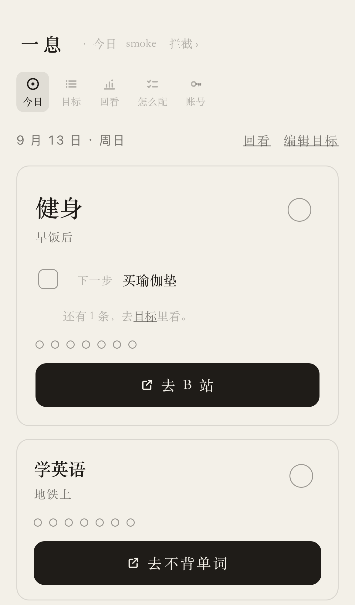

# Today

[← README](../README.md) · the other half of 一息 is [Breathe](breathe.md).

<p align="center">
  
</p>

<p align="center"><sub>Three goals, the first one large because it is the one that matters most today. Each card carries one next step, seven dots for the last seven days, and one wide button into the app the goal is about. No streak number anywhere.</sub></p>

`/today` is the page meant to be opened every morning: the few things that matter for the coming weeks, each with its next step, and a one-tap jump into whichever app the goal is actually about — B 站 for a workout, 微信读书 for a book. Nothing on it is editable. `/today/goals` behind it is where goals get added, reordered, extended and archived; `/today/review` looks back at how the days actually went.

It is shaped by one observation: the tool has to cost less time than the thing it is for, or it becomes the thing you do instead. So there are three cards and no fourth, one next step per card and not a list, no configuration on the page at all, and no streak counter anywhere in the product — a number that resets to zero is what makes people delete the app rather than start again. What it adds instead of pressure is one button that removes the steps between deciding and starting.

## The goal model

A **goal** is one of the few most important things for the coming weeks — 「健身」, 「读完那本书」, 「考完雅思」. Not a task list, not a habit streak. It carries:

- a title, the one line you would say out loud;
- an optional **cue** — 「早饭后」, 「地铁上」 — which is purely displayed, never enforced. Naming when you will do a thing is most of what makes it happen;
- an optional **deadline** (`until`). A goal past its deadline stops appearing on `/today` but is not deleted or hidden; it is lifted to the top of `/today/goals` with two buttons;
- an optional **jump target**: a custom URL scheme or an `https` link, plus a short label for the button (「B 站」 renders as 「去 B 站」; with no label the button says 「去做」);
- a position. Order is manual, and the first three live goals are the ones `/today` shows.

**Sub-tasks are one-off.** They hang under a goal, get ticked once and stay ticked — 「买瑜伽垫」, 「找一套 20 分钟跟练」. They are not habits and they do not come back tomorrow.

**A check-in is one per goal per day**, and idempotent by construction: the primary key is `(user_id, goal_id, date)`, and check and uncheck are the same request, so a double tap cannot double count. The day is the Asia/Shanghai calendar day, the same one the interception events use.

Archiving sets `archived_at` and keeps everything. Restoring clears it. Deleting — which is only reachable from inside the archive fold, two steps from the list, behind a confirm — removes the goal and its sub-tasks but **keeps the check-in history**, because the aggregate counts on `/today/review` are about days you showed up, not about goals that still exist.

Four tables carry all of it, added by `migrations/0004_goals.sql` and `0005_goal_days.sql`; nothing on the interception side was touched.

| Table | Key | Holds |
| --- | --- | --- |
| `goals` | `id` | title, cue, jump target and its label, position, `until`, `archived_at` |
| `goal_tasks` | `id` | one-off sub-tasks under a goal, with `done_at` |
| `goal_checkins` | `(user_id, goal_id, date)` | one row per goal per day you showed up |
| `goal_days` | `(user_id, date)` | the midnight snapshot: `shown`, `done`, `tasks_done` |

`user_id` is carried on every one of them, including `goal_tasks` where it is redundant with the goal, so that every write can be scoped by it — goal and task ids are globally sequential, and that condition is the only thing standing between one account and another's rows.

## `/today`

The page meant to be opened every morning, and the only one of the four that is not editable. Date and weekday at the top, links to 回看 and 编辑目标 on the right, and then the cards.

- **Three cards, one hero.** The first three non-archived, non-expired goals get a card; the first one is rendered large. Anything after the third folds into 「其余目标」, which lists names only and links into `/today/goals`. Fewer, with a clear first, is a product position rather than a technical limit — `TODAY_GOAL_LIMIT` in `src/types.ts` is the one constant that decides it.
- **A card shows three things.** The title (with the cue in small type beside it), one **next step** — the goal's first unfinished sub-task, with a box to tick it — and a check-in circle in the top right. Any further unfinished sub-tasks are one line: 「还有 N 条，去目标里看」. Sub-tasks finished today stay visible, struck through, with 撤销 next to them.
- **Seven dots.** One row of seven circles inside the card, today rightmost, filled for the days you checked in. No numbers, no colour changes, **no streak count** — see [Design principles](#design-principles).
- **The button.** Full width at the bottom of the card, the loudest thing on it: 「去 B 站」, 「去微信读书」. With no jump target configured it degrades into a quiet link, 「去绑一个 App，一按就开」, pointing at that goal on `/today/goals`.
- **Checked cards sink.** Order inside each half is preserved, so the page reorders once per tap and never shuffles.
- **The empty state is the onboarding.** With no goals at all, the page is one sentence — 「先写一件最重要的事。」 — and one box. Submitting it creates the first goal.
- **When everything is done**, one quiet line: 「今天的事都做了。」 followed by 「其余的事，明天再说。」

Every action is a plain form POST that redirects back with a 303 — no fetch, so a pull-to-refresh cannot resubmit anything. The one piece of JavaScript paints the ink dot on a check-in before submitting, and handles the jump; without it every button still works.

## `/today/goals`

The planning page. Same shape as `/settings`: an add form folded at the top, one collapsed `<details>` per goal, POST/303/GET throughout.

- **Ordering** is 上移 / 下移 on each goal, swapping positions with the nearest *live* neighbour. An expired goal sits in the list but is never the thing you swap with, or the button would silently do nothing whenever an expired row happened to sit between two live ones.
- **Expiry is a decision, not a disappearance.** A goal past its `until` is lifted to the top of the page with 「到期了」 and two buttons: **续四周**, which moves the deadline 28 days out from today, or **归档**. Nothing about the copy treats expiry as failure.
- **Archived goals** fold into a section at the bottom, each with 恢复 and 删除. Delete is the only destructive action in the today face; it exists only here, it asks first, and the confirm text says exactly what it does: sub-tasks go, check-in history stays.
- **The jump-target field** is the same component `/settings` uses for URL schemes: a 试跳 button, and a folded candidate list by app name with the source of each candidate shown. None of the candidates is verified — only a jump on a real iPhone counts. The hint under the box is the one worth following: link to *that lesson, that book*, not the app's home screen.

## The nightly snapshot

A second cron, `0 16 * * *` — 00:00 Asia/Shanghai — writes one `goal_days` row per user who has a live goal, for the day that just ended:

```sql
goal_days (user_id, date, shown, done, tasks_done, ts)
```

`shown` is how many goals `/today` would have put a card on that day, `done` how many of those were checked in, `tasks_done` how many sub-tasks were finished. The row is written once and never rewritten.

**Why a snapshot rather than recomputation.** Check-ins can tell you how many goals you completed on any past day. They cannot tell you how many you were *supposed* to do — that set depends on order, on deadlines and on which goals were archived, all of which change. Recomputing last month from today's goal list would quietly rewrite history every time you reordered something. The snapshot pins what that day actually showed.

**Honesty over backfill.** If the Worker did not run one night, that day is a gap on `/today/review` — a dashed slot, not a zero and not an estimate. The cron names the day it is closing out by backing the clock up one minute before converting to a Shanghai date, so a tick at 00:00 summarises yesterday rather than the minute-old today. Re-running it is safe: the write is an upsert keyed on `(user_id, date)`.

The noon cron is unchanged and knows nothing about this one; it still only trims sessions, logins and rate-limit windows.

## `/today/review`

「回看」 — the goal-tending ledger, the counterpart to `/review`'s interception ledger. Server-rendered, no JavaScript, nothing editable.

1. **今天** — 「做了 2 / 3」, computed live with the exact selection rule `/today` uses. Today has not ended, so there is no snapshot for it; today is never read from the table even if a row for it somehow exists.
2. **最近 30 天** — thirty thin bars, today rightmost, each as tall as that day's `done / shown`. A day with a snapshot but nothing shown is a faint baseline; a day with no snapshot at all is a dashed slot. Underneath, two counts: how many of the thirty days have a record, and on how many you finished everything.
3. **每个目标** — every non-archived goal, not only the three `/today` shows: name, its own seven dots, and 「30 天 · 打卡 12 天」. A goal younger than thirty days uses its real age as the denominator, so a goal created four days ago reads 「4 天 · 打卡 3 天」. No streaks here either.
4. **这周** — how many sub-tasks you struck off since Monday (Asia/Shanghai). This is the one number on the page that does not come from a snapshot: it counts `goal_tasks` directly, because a snapshot's `shown` set can no longer name a goal that was later archived or deleted, while the work done under it still happened this week.

The page ends with one line pointing at the other ledger: 「拦截那边的记录在回顾。」 The two sets of statistics never mix.

## On the home screen

`/today/setup` is the today face's own 「怎么配」, and it is three paragraphs of instructions with no code behind them:

1. **Add to the home screen.** Open `/today` in Safari, Share → Add to Home Screen. It then opens full-screen with no address bar. The app serves a `manifest.webmanifest` (`start_url` `/today`, `scope` `/`, `display` `standalone`) and an `apple-touch-icon`, both public, both cacheable, neither carrying anything per-user. The icon is a base64 constant generated by `scripts/icon.mjs`, which is what keeps "zero external requests" true for this path too; the CSP allows exactly one extra source for it, `manifest-src 'self'`.
2. **A Shortcut as the entry point.** One action, Open URL, pointing at `/today`. Put it in a home-screen widget, bind it to the Action button on an iPhone 15 Pro or later, or to Back Tap under Accessibility.
3. **A time-of-day automation.** Shortcuts → Automation → Time of Day, every morning, running that shortcut with "Ask Before Running" off. **That is the reminder.** There are no push notifications, no Web Push and no service worker.

**The home-screen copy needs its own login.** iOS keeps a standalone web app's cookies separate from Safari's, so the first open after installing asks you to sign in again; the session then lasts 180 days. There is deliberately no `?k=<token>` in `start_url` to paper over this — a long-lived credential does not go into a URL that gets saved to a home screen.

On iPhone Safari, `/today` shows a dismissible banner explaining the two-step install. It never appears in standalone mode, never inside an in-app browser, and never again once dismissed.

## The jump rules

The button on a card obeys the same rule as the breathing page's 「继续」, for the same reason (CONTRIBUTING §2):

- **A custom scheme must be assigned inside the synchronous call stack of the click.** Safari only follows `bilibili://…` from inside a real gesture; any `await`, `.then()` or `setTimeout` between the tap and `location.href = …` and the navigation is silently swallowed — a dead button on the only platform this targets. The page's script is asserted against this in `test/today.test.ts`, the same way `test/breathe.test.ts` asserts it for the breathing page.
- **An `https` target opens in a new tab** (`target="_blank" rel="noopener"`) rather than through `location.href`. Inside a standalone home-screen window, navigating the window itself to an external site strands the user there with no back button.
- **Forbidden schemes are dropped twice**, at write time and again at render time — `javascript:`, `data:`, `vbscript:`, `blob:`, `file:` and `about:`, from the single list in `src/scheme.ts`. Guarding at the sink as well as at the gate is what makes a row inserted straight into D1 harmless.

Clicks on the button are not recorded. Whether the jump was useful is not a number this product collects yet.

## Design principles

Six things this face was built around, drawn from a read of the habit and day-planning apps people actually keep.

1. **The tool must cost less time than the thing it is for.** `/today` does exactly three things — look, jump, tick — and no configuration appears on it at all.
2. **Removing steps beats adding reminders.** The jump button is the main action, and the hint pushes you to link the specific lesson or book rather than an app's home screen; the cue field turns 「我要健身」 into 「早饭后跟练 20 分钟」.
3. **Streak counters cut both ways.** A run that breaks at fifteen days is the thing that makes people delete an app, and missing one day does not change whether a habit forms. So: seven dots, empty where they are empty, no count, no red, no lecture.
4. **Three things, and one of them first.** Only the first three goals get a card and the first is the large one, because a list with no hierarchy is a list you re-read every morning instead of acting on.
5. **Write for the days off, not only for the wins.** Empty, all-done and missed-yesterday each get at most a sentence, in the same quiet voice the breathing page uses. No exclamation marks, nothing that shames.
6. **Ceremony comes from one gesture, not from decoration.** The check-in blooms ink for 260ms and everything else stays plain — and it does not animate at all under `prefers-reduced-motion`.

## Known limits

- **A jump is only as good as the app's URL scheme.** Some apps have removed theirs entirely, and none of the candidates the picker offers is verified — only a jump on a real iPhone proves one. The scheme caveats are the same on both faces; the long version is in [docs/breathe.md](breathe.md#known-limits).
- **The home-screen copy is a separate login.** Installing to the home screen means signing in once more, and signing out there does not sign you out in Safari.
- **`https` targets leave the app window.** They open in Safari as a new tab by design; coming back is a task-switch, not a back button.
- **There are no reminders of the product's own.** A time-of-day Shortcuts automation is the whole mechanism, which means it is as reliable as the automation you set up and no more.
- **A missed night leaves a gap.** If the midnight cron does not run, `/today/review` shows a dashed slot for that day forever. Nothing backfills it.
- **The UI is in Chinese**, like the rest of the product.
